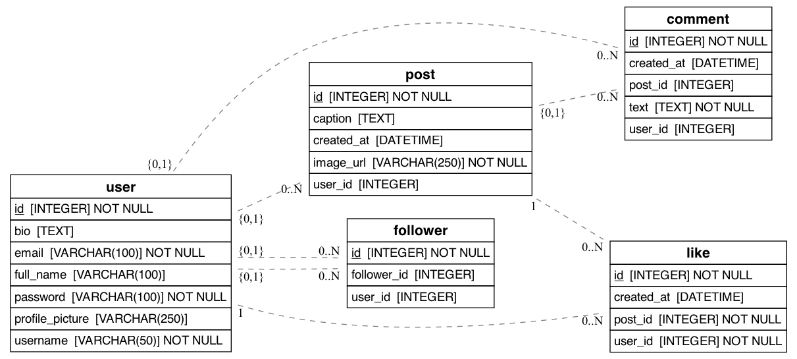

#  Create an ERD using Python

## Create the database model for Instagram

Inside the `src/models.py` file, you will find a couple of classes describing an example database.

The `diagram.png` file generates a database chart based on the classes that have been created. Such charts in Database Management are referred to as ERDs (Entity Relatonship Diagrams).

You will have to create the Entity Relationship Diagram for Instagram's Database. After my modification to the code it looks like:

## Solution

## Installation

1. Get inside the environment `$ pipenv shell`

2. Install all dependencies `$ pipenv install`

3. Generate the diagram as many times as you need `$ python src/models.py`

4. Open the file `diagram.png` to check out your ERD diagram!

## Instructions

Your job is to update the `src/models.py` file with the code needed to replicate Instagram's data model.

The project is using the SQLAlchemy Python library to generate the database.

- What tables do you think Instagram might have on its database: E.g: Post, User, etc.?
- What properties should go inside the User? or inside the Post table?
- Please add at least 4 models with all of their properties.
- Refresh the `diagram.png` file at the end by running `$ python src/models.py` on the console.

## Source

This exercise is part of the complete 4Geeks Academy Full Stack course:

